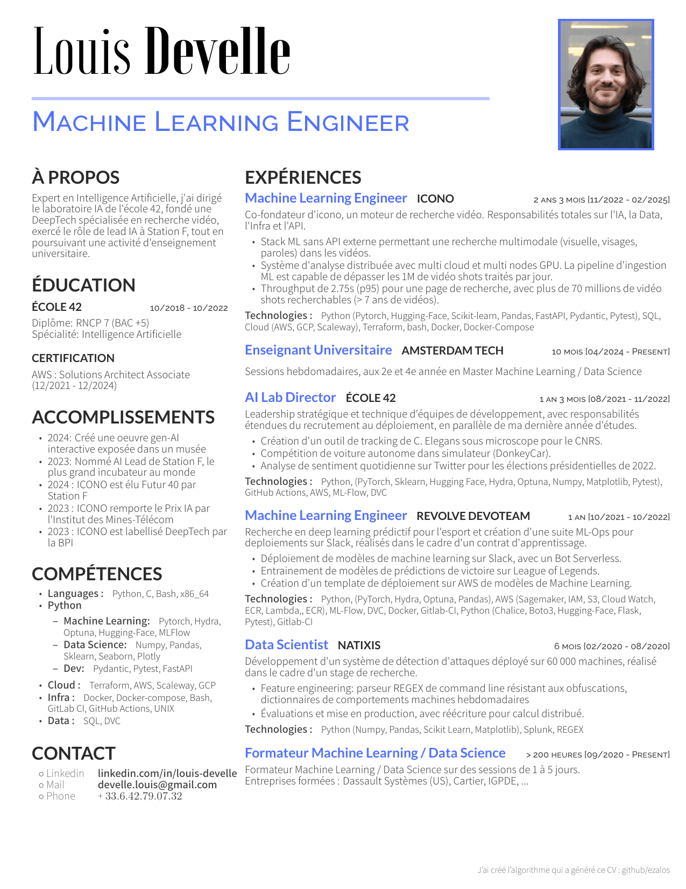

# Curriculum Vitae

Automatic Curriculum Vitae generation

- [Curriculum Vitae](#curriculum-vitae)
	- [My Resume](#my-resume)
	- [Project goals](#project-goals)
	- [Dependencies](#dependencies)
	- [Installation](#installation)
	- [Build Resume](#build-resume)
	- [Dev :](#dev-)

## My Resume



## Project goals

 - ✔️ A place where I can store a detailed memory of each position
 - ✔️ A tool which automatically re-generate an updated resume from them
 <!-- - 🚧 A tool which helps me to tailor my resume for a given position
   - Changing the accroche
   - Selecting which positions to display
   - For a position, selecting individual elements to display from :
     - accomplishments
     - responsibilities
     - technologies -->


## Dependencies

For this project you need to have installed:

 - `docker`
 - `uv`
 - apt:
   - pdftoppm
   - pngquant


## Installation

Install uv
```sh
curl -LsSf https://astral.sh/uv/install.sh | sh
```

Setup venv
```sh
uv venv
source .venv/bin/activate
uv sync
```

## Build Resume

```sh
bash build_it.sh My_Resume
```

## Dev :

Update requirements :

```sh
rm requirements.txt
uv pip compile pyproject.toml -o requirements.txt
```
