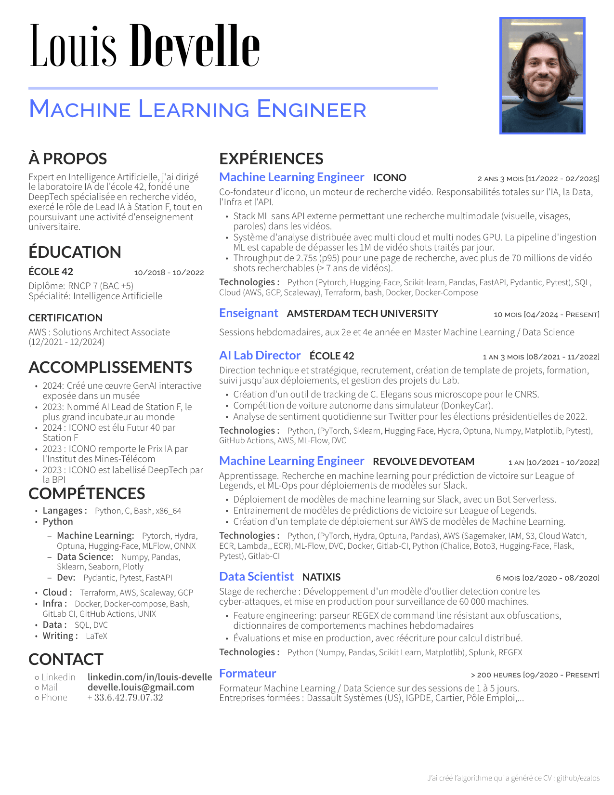

# Curriculum Vitae

Automatic Curriculum Vitae generation
# Curriculum Vitae

- [Curriculum Vitae](#curriculum-vitae)
- [Curriculum Vitae](#curriculum-vitae-1)
	- [My Resume](#my-resume)
	- [Project goals](#project-goals)
	- [Installation](#installation)
	- [Usage](#usage)
	- [Development](#development)
		- [Local Build](#local-build)
		- [Docker Build](#docker-build)
		- [Update requirements](#update-requirements)

## My Resume



## Project goals

 - ✔️ A place where I can store a detailed memory of each position
 - ✔️ A tool which automatically re-generate an updated resume from them
 <!-- - 🚧 A tool which helps me to tailor my resume for a given position
   - Changing the accroche
   - Selecting which positions to display
   - For a position, selecting individual elements to display from :
     - accomplishments
     - responsibilities
     - technologies -->

## Installation

- Install docker compose: https://docs.docker.com/compose/install/

## Usage

```sh
git clone https://github.com/ezalos/CurriculumVitae.git
cd CurriculumVitae
docker compose run --rm resume My_Custom_Resume
```

The built resume can be found in `resume/out/pdf/My_Custom_Resume.pdf`


## Development

### Local Build
```sh
bash scripts/build_resume.sh My_Resume
```

### Docker Build
```sh
# Build and run with default tag (latest)
docker compose up

# Build with a specific version
DOCKER_TAG=1.0.0 docker compose up

# Build and push with specific version
./scripts/build_and_push_docker.sh 1.0.0
```

### Update requirements
```sh
uv pip compile pyproject.toml -o requirements.txt
```
