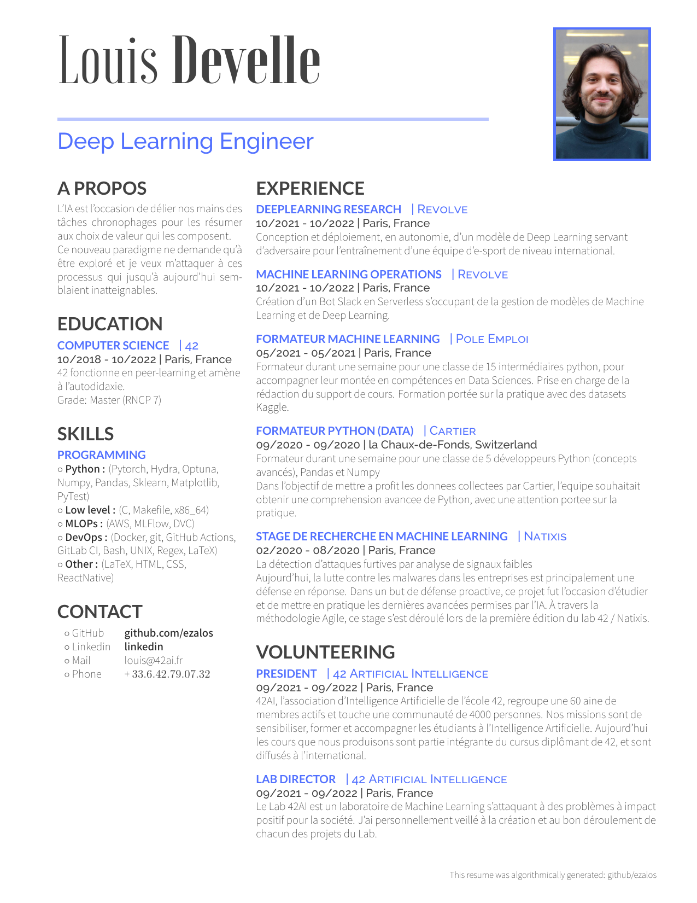

# Curriculum Vitae

Automatic Curriculum Vitae generation

- [Curriculum Vitae](#curriculum-vitae)
	- [My Resume](#my-resume)
	- [Dependencies](#dependencies)
	- [Installation](#installation)
	- [Build](#build)

## My Resume



## Dependencies

For this project you need:

 - `docker`
 - `conda` which uses python >= 3.8

## Installation


Optional step for conda + direnv combo:
```sh
echo "eval \"\$(conda shell.bash hook)\"" > .envrc
echo "conda activate resume" > .envrc
direnv allow
```

Env creation:
```sh
conda env create --file environment.yml
conda activate resume
```


## Build

```sh
export CV_DIR_LATEX=`pwd`/resume_latex
python -m MakeResume && \
docker run --rm -i -v $CV_DIR_LATEX:/data -v $CV_DIR_LATEX/fonts:/root/.fonts mingc/latex xelatex cv_12.tex && \
mv -f $CV_DIR_LATEX/cv_12.pdf CV_Louis_DEVELLE.pdf && \
pdftoppm CV_Louis_DEVELLE.pdf CV_Louis_DEVELLE -png -f 1 -singlefile
```
